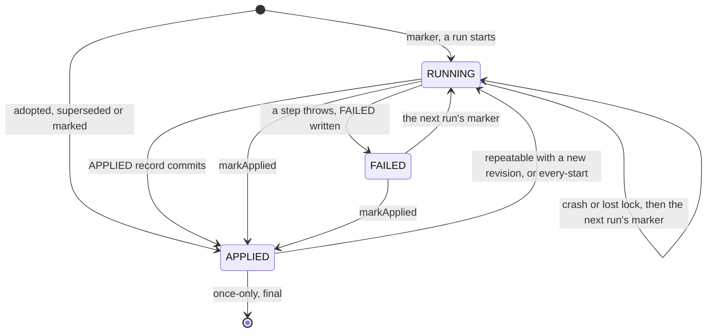

# Architecture

This page describes how godwit works inside: its components, the runner's algorithm, the state machine every migration
goes through, the exact database operations behind the lock and the history, the read and write concerns, and the
deployments godwit supports. It is for contributors and for users who want to reason about a failure from first
principles. Nothing here is public API; the guarantees godwit makes are stated on the other pages, and this page
explains why they hold.

## Contents

- [Components](#components)
- [One `migrate` call](#one-migrate-call)
- [Running one migration](#running-one-migration)
- [The per-migration state machine](#the-per-migration-state-machine)
- [Lock operations](#lock-operations)
- [History writes](#history-writes)
- [The fenced `APPLIED` record](#the-fenced-applied-record)
- [Checkpoint writes](#checkpoint-writes)
- [Error guidance](#error-guidance)
- [Read and write concerns, timeouts](#read-and-write-concerns-timeouts)
- [Topology check](#topology-check)
- [Compatibility](#compatibility)
- [Schemas](#schemas)
- [Threads and state](#threads-and-state)
- [Edge cases](#edge-cases)
- [Design decisions](#design-decisions)
- [See also](#see-also)

## Components

godwit-core is a handful of internal components behind the `Godwit` class. Only `Godwit`, the declaration functions,
the scopes, the DDL helpers, `validateMigrations`, the configuration, the result types and the exceptions are public.

| Component | Pure or I/O | Touches | Does |
|---|---|---|---|
| Validation (`validateMigrations`) | pure | nothing | Checks the list: id format, duplicates (including `supersedes` ids), numeric prefixes increasing, repeatable and every-start placement, revisions, batch sizes. Public, so a unit test runs the same check |
| Planner | pure | nothing | From the list, the history documents, the target and the configuration, computes the plan: what is due, in which order, which squashes to record, the conflicts (out of order, partial supersede, unknown applied under `FAIL`), the unknown applied ids, whether a transactional step is due, whether the database is untracked. While adoption can still run, it leaves out the out-of-order and partial-supersede conflicts, which the plan made under the lock, after the hook has run, checks |
| History store | I/O | `godwit-history` | Reads every document; writes the `RUNNING` marker, the fenced `APPLIED` record, checkpoints, `FAILED`, and the `ADOPTED`, `SUPERSEDED` and `MARKED` records |
| Lock | I/O, one thread | `godwit-lock` | Acquires with polling, renews from a heartbeat thread, keeps the local deadline, answers `checkLock()` without I/O, releases |
| Topology check | I/O | `hello` | Tells a replica set or `mongos` from a standalone server, only when a transactional step is due or adoption has ids to record |
| Adoption | I/O | the app's hook, `listCollections` | Calls `GodwitConfig.adoptApplied` under the lock while every history document is `ADOPTED` (or there is none), inserts the `ADOPTED` documents history does not hold yet with upserts that only insert (one transaction on a replica set), lists collections for the untracked-database guard |
| Runner | I/O | the app's data, through the scopes | Runs each due migration: marker, outside step, transaction or pages, `APPLIED` record, failure handling, logging, the report |
| Scopes | | | `OutsideTransactionScope` and `TransactionScope`: the database, counters, `checkLock()`, and in a transaction the session and attempt number |
| DDL helpers | I/O | the app's collections | `ensureCollection`, `ensureSearchIndex`, `dropIndexIfExists`: public extensions, and members of the outside step's scope |

The split between the planner and everything else is deliberate: every decision about what to run is a pure function
of data, tested exhaustively without a database, and the I/O components only carry the decisions out.

## One `migrate` call

```text
migrate(migrations, target):
  validateMigrations(migrations); check target               -> InvalidMigrationsException      (no I/O)
  runId = new UUID
  history = historyStore.readAll()                           majority read concern, primary
  adopting = config.adoptApplied != null and every history document has origin ADOPTED
                                                             true on an empty history
  plan = planner.plan(migrations, history, target, config, adopting)
  if plan.conflicts: throw PlanConflictException             unknown applied under FAIL; out of order and partial
                                                             supersede only when not adopting
  if plan.unknownApplied: log WARN "Unknown applied migrations"
  if plan.nothingDue:                                        the fast path: no lock, so no hook
      log INFO "Migrations up to date"
      return report(lockWait = null)
  if plan.needsTransactions and topology is standalone:
      throw TransactionsUnsupportedException                 before the lock, nothing written
  lock.acquire(config.lock.waitTimeout)                      -> LockTimeoutException
  log INFO "Acquired migration lock"
  try:
      history = historyStore.readAll()                       again: another process may have run them
      if config.adoptApplied != null and every history document has origin ADOPTED:
          returned = config.adoptApplied(database)           the app's hook
          lock.checkLock()
          adopted = declared once-only and superseded ids among returned, minus the ids history holds
          historyStore.recordAdopted(adopted)                upserts that only insert: one withTransaction,
                                                             checkLock() before the commit; on a standalone server
                                                             one write per id, checkLock() before each, last-listed
                                                             first
          log INFO "Adopted applied migrations"              adopted, and the returned ids the list ignores
          history = historyStore.readAll()
      plan = planner.plan(migrations, history, target, config, adopting = false)
      if plan.conflicts: throw PlanConflictException         every conflict, an adoption gap included
      if plan.needsTransactions and topology not checked yet and topology is standalone:
          throw TransactionsUnsupportedException             a transactional step became due under the lock
      if plan.untracked and config.untrackedDatabase == REFUSE:
          throw UntrackedDatabaseException                   history empty, nothing adopted, collections present
      for m in plan.toRecordAsSuperseded: historyStore.recordSuperseded(m); log INFO
      for m in plan.due: run(m)                              once-only in list order, then repeatable and every-start in list order
      log INFO "Migrations complete"
      return report
  finally:
      lock.release()                                         stops the heartbeat; fenced on the owner token
```

Points that follow from it:

- **Conflicts are checked before the fast path.** `UnknownApplied.FAIL` therefore stops a start that has nothing to do,
  which is the case it exists for (an older release started on a newer database). Out-of-order and partial-supersede
  conflicts always involve a due migration, so they would stop the call either way.
- **While adoption can still run, the order checks wait for the hook.** With `adoptApplied` configured and every
  history document `ADOPTED`, the plan made before the lock leaves out the out-of-order and partial-supersede conflicts;
  the plan made under the lock, after the hook has run and its ids are recorded, checks them. An adoption interrupted
  on a standalone server leaves the later ids recorded and the earlier ones missing, which is a gap. Checked before the
  lock, the gap would throw `PlanConflictException` under `OutOfOrder.FAIL` on every start before the hook could
  complete the adoption. Under `OutOfOrder.RUN` the pre-lock plan reports no conflict; the missing ids are not run
  because the plan that runs is made after the hook has recorded them. Both conflicts involve a due migration, so
  deferring them never sends a start down the fast path.
- **The untracked-database guard runs under the lock.** An empty history read before the lock could be a race with
  another process that has just started a new database's first migration; under the lock, an empty history is
  definitive. An empty history is never the fast path (everything is due), so it always reaches the lock.
- **The plan made before the lock only decides whether to wait.** The plan that runs is made after re-reading history
  under the lock ([locking.md](locking.md#re-reading-history-after-acquiring-a-rolling-deploy)).
- **The transaction check runs before the lock, and again under it when needed.** Re-planning under the lock usually
  removes due migrations, but it can add one: a repeatable becomes due when a process of an older release applied its
  older revision while this one waited
  ([repeatable-migrations.md](repeatable-migrations.md#an-older-release-starts-after-a-newer-one)). When the plan made
  under the lock has a transactional step due and the pre-lock plan had none, godwit runs `hello` then, so a standalone
  server still gets `TransactionsUnsupportedException` rather than the driver's misleading error.
- **Adoption completes itself.** The hook runs on every start that takes the lock while history holds nothing but
  `ADOPTED` documents, and each call records only the ids history lacks, with upserts that only insert, so a repeated
  call changes nothing recorded and removes nothing. On a replica set the documents of one call commit in one
  transaction, run through the driver's `withTransaction`: a transient error such as a primary stepdown is retried in
  the same call, and a process that dies while it records them leaves either all of them or none, so the next start
  records whatever is missing (nothing, if the commit applied). A standalone server has no transactions: there godwit
  writes the documents one at a time, and the next start records the ones an interruption left out. A document of
  another origin (`RAN`, `SUPERSEDED`, `MARKED`) ends adoption; godwit decides from the history each start reads, so
  deleting every such document by hand reopens it. The standalone writes go last-listed id first, in the reverse of
  the list's once-only order where each migration is preceded by the ids its `supersedes` list names, so that a start
  without the hook sees a partial adoption as a gap before a recorded id, which `OutOfOrder.FAIL` refuses, or as a
  partial supersede, which is always refused, and not as a shorter prefix whose missing migrations would run.

`status(migrations)` is the first half of this: validate, read history, plan, with no lock, no adoption and no writes.
It plans with the same `adopting` flag, so while adoption can still run it reports neither the out-of-order and
partial-supersede conflicts nor an untracked database: only `migrate` runs the hook, which may resolve them. The ids
adoption has not recorded are pending.
`requireUpToDate` throws when `status` is not up to date. `history()` is `historyStore.readAll()` mapped to
`HistoryEntry`.

```text
markApplied(id, reason):
  require(reason is not blank)                               -> IllegalArgumentException     (no I/O)
  lock.acquire(config.lock.waitTimeout)                      -> LockTimeoutException
  try:
      history = historyStore.readAll()                       majority read concern, primary
      if config.adoptApplied != null and every history document has origin ADOPTED:
          throw IllegalStateException                        adoption has not ended; true on an empty history
      if history[id] is REPEATABLE or EVERY_START:
          throw IllegalArgumentException
      historyStore.recordMarked(id, reason)                  conditional upsert on state != APPLIED
      log WARN "Marked migration applied"                    only when the write changed the document
  finally:
      lock.release()
```

The adoption check uses the history read that `markApplied` makes under the lock. A `MARKED` document ends adoption, so
a mark made while the hook can still run would keep it from recording the ids it has not recorded yet, and the next
start would run them over the live data. The exception's message names both ways forward: run `migrate()` first so
the hook adopts, or mark from a `Godwit` built from the same configuration with `adoptApplied = null`, which skips the
check, writes to the same history and lock collections, and is the path for a deliberate repair, with every instance
stopped. The repeatable and every-start check applies in any state, `APPLIED` included. The write is in
[History writes](#history-writes).

## Running one migration

```text
run(m):
  lock.checkLock()
  doc = historyStore.markRunning(m)          once-only: conditional upsert, sent once more after a duplicate key
                                             (11000); a second one -> already APPLIED by another run: skip it,
                                             report it as up to date
                                             repeatable, every-start: unconditional upsert
  lock.checkLock()                           a run whose marker landed after another run acquired stops here
  if the previous state was RUNNING: log WARN "Resuming interrupted migration"
  if m is out of order (OutOfOrder.RUN): log WARN "Running out-of-order migration"
  log INFO "Running migration"
  try:
      prepared = m.outsideStep?.invoke(OutsideTransactionScope)     no session; counters of this run
      lock.checkLock()
      when m.transactionalStep:
          none          -> nothing here: the APPLIED record follows the try, as godwit's own write
          inTransaction -> session.withTransaction(snapshot, majority, primary) {
                               attempt += 1                                  per run of the body
                               if attempt > 1: sleep(backoff(attempt))       5 ms x 1.5 per run, at most 500 ms, jitter
                               scope = TransactionScope(session, attempt)    counters start empty
                               lock.checkLock()
                               body(scope, prepared)                         the same prepared instance every run
                               lock.checkLock()
                               historyStore.recordApplied(session, m, counts + scope.counts)   fenced: matches 0 -> LockLostException
                           }
          inBatches     -> pages(m, doc.checkpoint)
  catch e:
      if e is LockLostException:                                           checkLock() or a fence stopped the step
          log ERROR "Migration failed"; throw e                            no history write
      if the lock is lost by now:                                          a step error and a lock loss together
          historyStore.markFailed(m, e)                                    fenced: matches only while no other run has
                                                                           taken the document over and no commit applied
          log ERROR "Migration failed"; throw LockLostException(m.id, cause = e)
      if historyStore.markFailed(m, e) matched nothing:                    outside any transaction, fenced on owner and RUNNING
          doc = historyStore.read(m.id)                                    majority read concern, primary, after the
                                                                           no-op's majority wait
          if doc is APPLIED with this run's owner:                         the commit applied; only its reply failed
              log INFO "Applied migration"; continue with the next migration
          log ERROR "Migration failed"; throw LockLostException(m.id, cause = e)   another run owns the document
      log ERROR "Migration failed"
      throw MigrationFailedException(m.id, step, report so far, e, guidance(e))
  if m has no transactional step:
      try: historyStore.recordApplied(m, counts)                     outside any transaction, fenced on owner and RUNNING
      catch LockLostException: log ERROR "Migration failed"; throw   the fence matched nothing: another run owns it
      catch a driver error d:                                        godwit's own write, not a step failure
          try: historyStore.recordApplied(m, counts)                 the same fenced write, once more, majority
          catch LockLostException:                                   matched nothing: acknowledged once the first
                                                                     write (if it applied) is majority-committed
              doc = historyStore.read(m.id)                          majority read concern, primary
              if doc is not APPLIED with this run's owner: throw d   another run owns the document
          catch another error e: throw d, with e suppressed          the next start finds it APPLIED or resumes it
  log INFO "Applied migration"
```

- The `RUNNING` marker is written before any step, outside any transaction, with majority write concern, on the same
  causally consistent session that later carries the transaction, so the transaction's snapshot sees it.
- `checkLock()` runs again right after the marker. A run that lost the lock between its first check and its marker (a
  pause longer than the lease) can have its marker land after another run acquired the lock and wrote its own marker;
  the once-only filter matches that `RUNNING` document and takes it over. The other run acquired only after the
  server lease ended, at least `safetyMargin` after this run's local deadline, so this run's check after the marker
  throws `LockLostException` before any step runs. The run whose document was taken over finds out at its next fenced
  write, which matches nothing: it throws `LockLostException` too, and the next start resumes the migration. A stale
  marker costs a retry, never a second commit.
- A run that lost the lock writes nothing more to history, with one exception: when a step's own error and the lock
  loss coincide, it still sends the `FAILED` write, so that `lastError` keeps the step's error. That write is fenced on
  this run's owner token and `RUNNING`, so it matches only while no other run has written its marker; once one has,
  it matches nothing and the process that took the lock over owns the document. Either way `migrate` throws
  `LockLostException` with the step's error as its cause. A lock loss alone (a `LockLostException` from `checkLock()`
  or a fence) writes nothing.
- The driver can throw after a commit that applied: a client-side `timeoutMS` that ends during the commit's majority
  wait (the driver does not retry a `MongoOperationTimeoutException` on commit), or commit retries that run out of the
  120 s window. The same holds for the last page of an `inBatches` step. The `FAILED` write is therefore fenced on
  `state: RUNNING` as well as the owner: on a document that the failed-looking commit made `APPLIED`, it matches
  nothing, and godwit reads the document instead of recording a failure. Without the state in the fence, the next
  start would find `FAILED` and run the transactional step again. The `FAILED` write has majority write concern, and
  the server acknowledges a write that matches nothing only once everything before it, the commit included, is
  majority-committed; the read that follows, with majority read concern, therefore sees the commit. A majority read
  right after the commit's timeout could not: while the majority lags, the commit is not majority-committed yet.
- Commit retries that run out of the 120 s window mean the primary or the majority was out of reach for that long.
  The heartbeat's renewals, majority writes on the same client, fail with them, so under the default lease the local
  deadline (50 s after the last renewal was sent) has passed by then. godwit then takes the lost-lock branch: the
  fenced `FAILED` write matches nothing on the `APPLIED` document, and `migrate` throws `LockLostException` with the
  commit's error as its cause, without reading the document. The migration is applied all the same, and the next
  start finds it `APPLIED`. With a lease longer than that window, or with a client-side timeout, which ends the
  retries sooner, the lock can still be held when the driver gives up, and the migration is reported as applied.
- The `APPLIED` record of a migration with only an outside step is godwit's own write, after the step, and its failure
  is not the step's: godwit writes no `FAILED` for it. After a driver exception it sends the same fenced record once
  more, with majority write concern. When the first one never reached the server, the second records the migration.
  When the first one applied and only its reply failed (a lost reply, a client-side timeout during its majority wait),
  the second matches nothing, and the server acknowledges it only once the first is majority-committed; godwit then
  reads the document (majority read concern, primary), and `APPLIED` with this run's owner token means the migration
  is applied. A read alone, right after a timeout, could not see the first write while the majority lags. When the
  second write fails too (the same outage, or a majority still behind once its own `timeoutMS` passes), the read fails,
  or another run owns the document, the first exception propagates unchanged, with any later one attached as
  suppressed: the next start finds the migration `APPLIED`, or resumes it
  ([failure-and-recovery.md](failure-and-recovery.md#history-write-fails)).
- If the `FAILED` write itself fails, the document stays as the step left it and the `MigrationFailedException` (or
  the `LockLostException`) carries the write's exception as a suppressed exception. That is `RUNNING`, which the next
  start resumes, or `APPLIED` when a commit applied although the driver threw and the majority was still behind when
  the `FAILED` write's own `timeoutMS` passed, which the next start finds applied. Other history and lock write
  failures propagate as the driver's exceptions ([failure-and-recovery.md](failure-and-recovery.md#history-write-fails)).
- `withTransaction` is the driver's: it re-runs the body on `TransientTransactionError` and retries the commit on
  `UnknownTransactionCommitResult`, for up to 120 s. godwit wraps the body to count attempts, pause before each attempt
  after the first (driver 5.7.0 has no backoff of its own), reset counters, time each attempt (`Slow transaction` above
  `slowTransactionWarning`) and log `Retrying transaction`: for the first retry of a transaction, then at most every
  10 s, with `error` set to the error the previous attempt's body threw, or `commit` when the body returned and the
  driver retried after a transient error on commit. `transactionRetries` counts every retry.

## The per-migration state machine



| From | Event | To | Written by | Fence |
|---|---|---|---|---|
| (none) | A run starts | `RUNNING` | marker upsert, outside any transaction | Once-only: `state != APPLIED` |
| (none) | Adoption | `APPLIED` (`ADOPTED`) | upsert that only inserts (`$setOnInsert`), under the lock, only while every document is `ADOPTED`, and only for ids the history read under the lock lacks | none: an existing document matches and stays unchanged |
| (none) | Squash, `markApplied` | `APPLIED` (`SUPERSEDED`, `MARKED`) | conditional upsert, under the lock; `markApplied` only once adoption has ended, or on a `Godwit` without `adoptApplied` | `state != APPLIED` |
| `RUNNING` | The last step's work commits | `APPLIED` (`RAN`) | inside the step's transaction, or after an outside-only step | `owner` = this run, `state` = `RUNNING` |
| `RUNNING` | A step throws (also when the lock is lost at the same moment) | `FAILED` | after the step, outside any transaction | `owner` = this run, `state` = `RUNNING`; matching nothing means a commit applied (`APPLIED` by this run) or another run took over |
| `RUNNING` | Process dies, lock lost | `RUNNING` (unchanged) | nobody | |
| `RUNNING` or `FAILED` | The next run starts | `RUNNING`, `attempts` + 1 | marker upsert | Once-only: `state != APPLIED` |
| `RUNNING` or `FAILED`, once-only | `markApplied` | `APPLIED` (`MARKED`) | conditional update, under the lock | `state != APPLIED` |
| `APPLIED`, repeatable | Revision differs | `RUNNING`, `attempts` = 1 | unconditional marker upsert, under the lock | none |
| `APPLIED`, every-start | Every `Target.Latest` start | `RUNNING`, `attempts` = 1 | unconditional marker upsert, under the lock | none |
| `APPLIED`, once-only | anything | `APPLIED` | nobody: every write is conditional on `state != APPLIED` | |

## Lock operations

The lock collection handle uses majority write concern, majority read concern, primary reads, the driver's default
codec registry and a 5 s client-side timeout on every operation. In `mongosh` form, with the defaults (`lease` 60 s), the
history collection `godwit-history` and an owner token `5b0f3c6e-2a41-4f7e-9d1c-0e8a7b6c5d4f`:

**Acquire.** An upsert on the lock document's `_id`. Its pipeline takes the lock if it is expired, released or
missing, and otherwise leaves the document as it is:

```javascript
db.getCollection("godwit-lock").findOneAndUpdate(
  { _id: "godwit-history" },
  [
    {
      $replaceWith: {
        $cond: [
          { $lte: ["$expiresAt", "$$NOW"] },                              // expired or released; a missing expiresAt counts as expired
          {
            _id: "$_id",
            owner: { $literal: "5b0f3c6e-2a41-4f7e-9d1c-0e8a7b6c5d4f" },
            holder: { $literal: "shop-7f9c4/1" },                       // $literal: a configured holder may start with "$"
            runId: { $literal: "0199a4c2-7b1e-7c3d-9f00-3b2a1c4d5e6f" },
            acquiredAt: "$$NOW",
            refreshedAt: "$$NOW",
            expiresAt: { $add: ["$$NOW", 60000] }
          },
          "$$ROOT"                                                        // held by another run: unchanged
        ]
      }
    }
  ],
  { upsert: true, returnDocument: "after", writeConcern: { w: "majority" } }
)
```

| Lock document | Result |
|---|---|
| Missing | The upsert inserts `{_id: "godwit-history", ...}` with this run's token: acquired |
| Expired or released | Replaced with this run's token, without `releasedAt`: acquired |
| Held by this run (the same token again) | Left unchanged; the returned document carries this run's token: acquired |
| Held by another run | Left unchanged; the returned document carries the other run's token: not acquired, wait |
| Missing, two processes at once | One insert wins; the other hits the duplicate `_id`, which the server retries as an update, and that update finds the lock held: not acquired, wait |

The returned document is the answer: this run's token means acquired, another token means held. The condition lives
in the pipeline because the server refuses `$expr` in the query of an upsert, and an equality filter on `_id` is what
lets the server retry an upsert that hits a duplicate key, so two processes racing on a missing document both get a
document back. A duplicate key that reaches godwit all the same counts as held.

**Renew** (the heartbeat, every `heartbeat`):

```javascript
db.getCollection("godwit-lock").updateOne(
  { _id: "godwit-history", owner: "5b0f3c6e-2a41-4f7e-9d1c-0e8a7b6c5d4f", releasedAt: { $exists: false } },
  [{ $set: { refreshedAt: "$$NOW", expiresAt: { $add: ["$$NOW", 60000] } } }],
  { writeConcern: { w: "majority" } }
)
```

`matchedCount` 0 means another run owns the lock, or the document was deleted: the lock is lost. The filter on
`releasedAt` is for a renewal that reaches the server after this run's release (below); an acquire replaces the whole
document, so a new acquisition carries no `releasedAt`.

**Release** (in `finally`). It first stops the heartbeat and waits for a renewal in flight to return, which the 5 s
timeout bounds, so that the release is the last lock write the run sends. A renewal can still reach the server after
it: one the client gave up on at its timeout, delivered late by the network. The release keeps `owner` for
diagnostics, so the renewal's filter on `releasedAt` is what makes such a renewal match nothing, instead of holding a
released lock for another lease:

```javascript
db.getCollection("godwit-lock").updateOne(
  { _id: "godwit-history", owner: "5b0f3c6e-2a41-4f7e-9d1c-0e8a7b6c5d4f" },
  [{ $set: { expiresAt: "$$NOW", releasedAt: "$$NOW" } }],
  { writeConcern: { w: "majority" } }
)
```

A release that matches nothing changes nothing: the lease already belongs to another run. A release that fails (the
database is unreachable) is not retried; it logs `Lock release failed` at WARN, and the lease ends on its own.

**Waiting.** While the acquire returns "held", godwit sleeps 250 ms, doubling up to 5 s, each sleep a random time
between half and all of that step, and every 10 s reads the lock document while its lease lasts to log the holder:

```javascript
db.getCollection("godwit-lock").findOne({
  _id: "godwit-history",
  holder: { $type: "string" }, runId: { $type: "string" },
  acquiredAt: { $type: "date" }, expiresAt: { $type: "date" },   // a document godwit did not write names no holder
  $expr: { $gt: ["$expiresAt", "$$NOW"] }
})
```

When the lease has ended by then, or the document lacks one of those fields (a document written by hand), it logs
nothing and tries again. When `waitTimeout` passes, it makes a last attempt and reads the document once more for
`LockTimeoutException.holder` (null in the same cases).

**The heartbeat and the local deadline.** After the acquire, a single daemon thread renews the lease every
`heartbeat`. The first local deadline is the monotonic time the acquire was sent, plus `lease` minus `safetyMargin`.
Each renewal records the monotonic time it was sent; when it succeeds, the local deadline becomes that time plus
`lease` minus `safetyMargin`. Before every renewal the thread checks the deadline: once it has passed, the lock is
lost for good, and the thread stops without renewing (a renewal sent after a long pause could otherwise extend a lease
the run has already given up). A renewal that succeeds only after the deadline has passed does not move it: the lock
is lost. A renewal that throws logs `Lock renewal failed` at WARN and is retried at the next tick; the deadline
decides. A renewal that matches nothing, or a deadline that passes, marks the lock lost and logs `Lost migration lock`
at WARN, once per run, with `reason` `NOT_OWNER` or `DEADLINE_PASSED`; when `checkLock()` on the step's thread sees
the deadline pass first, it logs the line instead. The thread catches every `Throwable`, because an exception escaping
a scheduled task silently cancels every later run of it.

**`checkLock()`** throws `LockLostException` when the lost flag is set or the monotonic clock is past the deadline. It
does no I/O, so a step can call it once per item.

The lock document has only its `_id` index. There is no TTL index ([locking.md](locking.md#why-there-is-no-ttl-index)).

## History writes

The history collection handle uses majority write concern, majority read concern, primary reads and the driver's
default codec registry. Documents are `org.bson.Document`. The collection is created by its first upsert; godwit creates
no index on it.

**Read** (start of every call, again under the lock):

```javascript
db.getCollection("godwit-history").find({}).sort({ _id: 1 }).batchSize(2147483647).readConcern("majority")
```

The largest batch size brings the whole history back in the first reply, up to the 16 MiB a reply carries. Without
it the server's first batch stops at 101 documents, and a longer history would take a `getMore` on every start.

**`RUNNING` marker, once-only migration.** A conditional upsert. If the document is `APPLIED`, the filter matches
nothing and the upsert's insert collides with the existing `_id`: duplicate key (11000). The same error answers a
marker that races another first write of a missing document: one insert wins, and the server does not retry the other
as an update, which it does only for a filter of equalities on `_id`. So godwit sends the marker once more. The
document exists by then and the filter matches it, unless it is `APPLIED`: a second duplicate key means it is, which
godwit reads as "applied by another run" and skips the migration:

```javascript
db.getCollection("godwit-history").findOneAndUpdate(
  { _id: "004-order-status", state: { $ne: "APPLIED" } },
  {
    $set: {
      kind: "ONCE", steps: ["IN_TRANSACTION"], state: "RUNNING", origin: "RAN",
      owner: "5b0f3c6e-2a41-4f7e-9d1c-0e8a7b6c5d4f", holder: "shop-7f9c4/1",
      runId: "0199a4c2-7b1e-7c3d-9f00-3b2a1c4d5e6f", startedAt: new Date(), godwitVersion: "0.1.0", v: 1
    },
    $inc: { attempts: 1 }
  },
  { upsert: true, returnDocument: "after", writeConcern: { w: "majority" } }
)
```

The returned document carries `checkpoint` (where an `inBatches` step resumes) and the previous `lastError`, which stays
until the migration applies.

**`RUNNING` marker, repeatable and every-start migration.** Unconditional on state, because an `APPLIED` document must
go back to `RUNNING` when the revision changes (or on every start). `attempts` restarts at 1 after an `APPLIED`:

```javascript
db.getCollection("godwit-history").findOneAndUpdate(
  { _id: "reference-countries" },
  [
    {
      $set: {
        kind: "REPEATABLE", steps: ["IN_TRANSACTION"], state: "RUNNING", origin: "RAN",
        attempts: { $cond: [{ $eq: ["$state", "APPLIED"] }, 1, { $add: [{ $ifNull: ["$attempts", 0] }, 1] }] },
        owner: { $literal: "5b0f3c6e-2a41-4f7e-9d1c-0e8a7b6c5d4f" }, holder: { $literal: "shop-7f9c4/1" },
        runId: { $literal: "0199a4c2-7b1e-7c3d-9f00-3b2a1c4d5e6f" }, startedAt: new Date(),
        godwitVersion: "0.1.0", v: 1
      }
    }
  ],
  { upsert: true, returnDocument: "after", writeConcern: { w: "majority" } }
)
```

Both markers set `description` when the migration declares one and remove it when it does not, so the document shows
the description of its last run. In the pipeline, the description is a `$literal` too, and an absent one is
`"$$REMOVE"`.

Why two markers: the once-only marker's conditional filter is what makes an applied once-only migration impossible to
start again, even by a run that lost the lock and does not know it yet. It does not stop such a run's marker from
taking over another run's `RUNNING` document; the `checkLock()` after the marker and the owner fence handle that
([running one migration](#running-one-migration)). Reused for a repeatable, the same filter would hit
11000 on the `APPLIED` document and skip the repeatable forever. The unconditional marker is safe under the lock. The
one race it leaves (a run that lost the lock commits a repeatable just before the new holder's marker) makes the new
holder run that repeatable once more at the same revision, which a repeatable tolerates: it is written to run again.

**`APPLIED` record.** Inside the step's transaction (or on its own after an outside-only step), fenced on this run's
owner token and `RUNNING`:

```javascript
db.getCollection("godwit-history").updateOne(
  { _id: "004-order-status", owner: "5b0f3c6e-2a41-4f7e-9d1c-0e8a7b6c5d4f", state: "RUNNING" },
  {
    $set: {
      state: "APPLIED", counts: { ordersPaid: 1200, ordersPending: 37 }, transactionRetries: 0,
      durationMs: 84, finishedAt: new Date()
    },
    $unset: { lastError: "", checkpoint: "" }
  }
)
```

A repeatable also sets `revision` and `lastRunAt` and increments `runCount`; an every-start migration sets `lastRunAt` and
increments `runCount`; a migration run under `OutOfOrder.RUN` sets `outOfOrder: true`; a superseding migration that
runs stores `supersedes`. `matchedCount` 0 throws `LockLostException`, which aborts the transaction.

**`FAILED` record.** After the step's transaction aborted, outside any transaction, fenced on the owner token and on
`RUNNING`:

```javascript
db.getCollection("godwit-history").updateOne(
  { _id: "005-customer-external-ids", owner: "5b0f3c6e-2a41-4f7e-9d1c-0e8a7b6c5d4f", state: "RUNNING" },
  {
    $set: {
      state: "FAILED", durationMs: 30412, finishedAt: new Date(),
      lastError: {
        type: "java.net.http.HttpTimeoutException", message: "request timed out",
        stack: "java.net.http.HttpTimeoutException: request timed out\n\tat ...", step: "OUTSIDE_TRANSACTION",
        at: new Date()
      }
    }
  },
  { writeConcern: { w: "majority" } }
)
```

**`ADOPTED` records.** Under the lock, an upsert that only inserts: every field is in `$setOnInsert`, so a document
that already exists, whatever its state, matches and stays unchanged:

```javascript
db.getCollection("godwit-history").updateOne(
  { _id: "003-file-store" },
  {
    $setOnInsert: {
      kind: "ONCE", steps: [], state: "APPLIED", origin: "ADOPTED", attempts: 0,
      owner: "5b0f3c6e-2a41-4f7e-9d1c-0e8a7b6c5d4f", holder: "shop-7f9c4/1",
      runId: "0199a4c2-7b1e-7c3d-9f00-3b2a1c4d5e6f", finishedAt: new Date(), godwitVersion: "0.1.0", v: 1
    }
  },
  { upsert: true }
)
```

Adoption writes only the ids that the history read under the lock does not hold. The insert-only upsert keeps a write
harmless when that read is stale, as it is for a run that lost the lock while its hook read: on an existing document
it matches and changes nothing (a conditional upsert would raise a duplicate key there, which aborts a transaction,
or turn another run's `RUNNING` document into `ADOPTED`), and two transactions that insert the same id meet in a write
conflict, which the driver retries, after which the upsert matches. On a replica set the records of one call are
written in one transaction through the driver's `withTransaction` (snapshot read concern, majority write concern on
the commit, primary), with `checkLock()` before the commit: a transient error such as a primary stepdown is retried
in the same call, and any other error, a `LockLostException` included, leaves nothing recorded and propagates. On a
standalone server godwit writes one document per id with majority write concern, calling `checkLock()` before each,
last-listed first: in the reverse of the list's once-only order, where each migration is preceded by the ids its
`supersedes` list names, in that list's order.

**`SUPERSEDED` and `MARKED` records.** Under the lock, a conditional upsert on `state != APPLIED`, setting
`state: "APPLIED"`, the origin, `holder`, `owner`, `runId`, `finishedAt`, `godwitVersion` and `v`; inserted documents
also get `kind: "ONCE"`, `steps: []` and `attempts: 0` (`$setOnInsert`). `SUPERSEDED` stores `supersedes`; `MARKED`
stores `reason` and removes `lastError` and `checkpoint`. A duplicate key is sent once more, as for the once-only
marker; a second one means the id is already `APPLIED`, which leaves it unchanged.
`markApplied` checks the history it reads under the lock first, and writes nothing when it throws:
`IllegalStateException` while `adoptApplied` is set and every document is `ADOPTED` (or there is none), and
`IllegalArgumentException` when the id's document has `kind` `REPEATABLE` or `EVERY_START`, in any state.

## The fenced `APPLIED` record

The guarantee: a migration's transactional work commits at most once, and a run moves on to the next migration only
after its own `APPLIED` record for the previous one committed. The lock alone cannot promise this (a holder can lose it
without knowing), so the `APPLIED` record carries a fence: it matches only while the document still has this run's owner
token and is `RUNNING`.

| Timing | What happens |
|---|---|
| The run holds the lock throughout | The record matches; data and record commit together |
| The lock is lost, nobody has taken over | `checkLock()` before the record throws (the local deadline is at least `safetyMargin` before the lease ends): abort |
| Another run took over and wrote its marker first | The marker changed `owner`: the record matches nothing, `LockLostException`, abort |
| The stale run wrote its record first, then stalled before the commit | The new run's marker writes the same document outside any transaction, so it waits for the stale transaction to end. If it aborts (lifetime, or the stale run's own check), the marker goes through. If it commits, the marker's filter finds `APPLIED`, gets 11000 on both sends, and the new run skips the migration |

In every row, exactly one run's work for the migration is committed or none is. The alternative fence, writing the lock
document inside every migration transaction, would make every heartbeat renewal a write conflict with the open
transaction, and the driver would re-run the step on each renewal.

## Checkpoint writes

An `inBatches` step runs one transaction per page:

```text
pages(m, checkpoint):                         checkpoint from the marker's returned document (null on a first run)
  idType = typeClass(checkpoint.lastId) when there is a checkpoint, else null
  loop:
    next = session.withTransaction {          the body only reads the loop's variables; it assigns none of them
        attempt += 1 (attempts count per page); pause before attempts after the first; counters start empty
        lock.checkLock()
        filter = m.pending AND (_id > checkpoint.lastId, when there is a checkpoint)
        page = find(session, filter).sort({_id: 1}).limit(m.batchSize)
        pageType = idType ?: typeClass(page.first._id), when the page is not empty
        every _id in page has pageType, or fail naming both types
        if page is not empty: m.step(scope, page)
        lock.checkLock()
        if page.size < m.batchSize:                                   the last page, also when it is empty
            if pageType != null:                                      null only on a first run that found nothing
                no document matches m.pending with an _id of another type, or fail naming both types
                                                                      on a resumed run, pageType is the checkpoint's
            recordApplied(session, m, checkpoint.counts + scope.counts + outside step counts)
            Done
        else:
            newCheckpoint = (lastId = page.last._id, batches = checkpoint.batches + 1, counts = checkpoint.counts + scope.counts)
            writeCheckpoint(session, newCheckpoint)
            Page(newCheckpoint, pageType)
    }
    log DEBUG "Committed batch"
    if next is Page: checkpoint = next.checkpoint; idType = next.type   only after withTransaction returned
  until next is Done
```

`typeClass` is the BSON type of an `_id`, except that int, long, double and decimal are one class: `$gt` and the `_id`
sort compare numbers across numeric types, so a collection with int and long `_id`s pages correctly and passes the
check. The other-type query uses `$type: "number"` for that class.

`writeCheckpoint` is the same fenced update as the `APPLIED` record, setting only `checkpoint`:

```javascript
db.getCollection("godwit-history").updateOne(
  { _id: "006-order-totals", owner: "5b0f3c6e-2a41-4f7e-9d1c-0e8a7b6c5d4f", state: "RUNNING" },
  { $set: { checkpoint: { lastId: ObjectId("66fd0c4e9b1e8a0012a3f5c2"), batches: 1050, counts: { ordersUpdated: 525000 } } } }
)
```

- The page's writes, the checkpoint and (on the last page) the `APPLIED` record commit together, so no page commits
  twice and none is lost, whatever fails between pages.
- A run that resumes reads the checkpoint from its own marker's returned document. The marker waits for any stale
  transaction on the document to end, so it always sees the last committed checkpoint.
- The loop's checkpoint and type advance only after `withTransaction` returns. The driver can run the body again after
  a transient error on commit; a body that had already moved the checkpoint would then read the next page and leave the
  rolled-back one unprocessed.
- `pending` is evaluated on every page. A document that stops matching it (the app wrote the new field) is skipped.
- `$gt` on `_id` compares values of one BSON type only (numbers as one class), so a collection with mixed `_id` types
  would be partly skipped. The type checks turn that into a failure, with the committed pages and the checkpoint kept.
  BSON order puts numbers before strings and strings before ObjectIds, so the committed pages hold the type that sorts
  first, and a resumed run takes its type from the checkpoint, not from a page that may be empty.
- A page of exactly `batchSize` documents is never the last; the next page finds nothing, and its transaction commits
  only the `APPLIED` record. The step is never called with an empty page.

## Error guidance

When a migration fails, godwit looks at the cause and adds a second line to `MigrationFailedException`'s message for the
causes it recognises:

| Cause | Recognised by | Guidance line |
|---|---|---|
| Transaction past its lifetime | `NoSuchTransaction` (251) or `TransactionExceededLifetimeLimitSeconds` (290) after an attempt that ran at least 60 s | `The transaction ran past the server's transaction lifetime (transactionLifetimeLimitSeconds, 60 s by default). Process the documents with inBatches, or move work that needs no atomicity to outsideTransaction.` |
| Transaction too large | `TransactionTooLargeForCache` (388) | `The transaction was too large for the storage engine's cache. Process the documents with inBatches, or move work that needs no atomicity to outsideTransaction.` |
| DDL in a transaction | `OperationNotSupportedInTransaction` (263), or `InvalidOptions` (72) when `createIndexes` or `create` refuses the transaction's snapshot read concern | `DDL cannot run in a transaction: index builds on existing collections, drop, dropIndexes, renameCollection and collMod belong in outsideTransaction.` |
| Session from another client | The driver's `IllegalStateException` "ClientSession from same MongoClient" | `The step passed godwit's session to an operation on another MongoClient. Build Godwit and the services the migrations call from the same MongoClient.` |

godwit also looks at the causes of the step's exception, up to eight levels deep, so a service that wraps the
driver's error is recognised too. The cause itself is unchanged; the guidance only adds the line. Every page that
quotes a guidance line quotes it from this table, and the `MigrationFailedException` KDoc holds the same lines.

## Read and write concerns, timeouts

| Operation | Read concern | Write concern | Read preference | Timeout |
|---|---|---|---|---|
| History read | majority | | primary | the client's |
| Marker, `FAILED`, outside-only `APPLIED`, adoption, squash and `markApplied` records | | majority | primary | the client's |
| Lock acquire, renew, release, holder read | majority | majority | primary | 5 s per operation, client side |
| A transactional step's transaction (body, checkpoint, `APPLIED` record) | snapshot | majority | primary | the server's transaction lifetime (60 s by default); the driver's 120 s retry window |
| An outside step's operations | the client's | the client's | the client's | the client's |
| `hello` (topology check) | | | primary | the client's |

- **Majority for bookkeeping.** A lock acquired with `w:1` could be rolled back by a failover, leaving two holders; a
  history read below majority could see an `APPLIED` record that is later rolled back. The read that settles a history
  write whose reply failed comes after a fenced majority write that matches nothing, so it sees the write once it is
  majority-committed, and never reports a migration applied that a failover could still undo.
- **Snapshot transactions.** Reads inside the step see one consistent point in time, and with majority commit that
  point is majority-committed.
- **The 5 s lock timeout.** A renewal that hangs on a stalled majority would otherwise keep the heartbeat thread blocked
  past the lease. With the timeout, the failure surfaces and the local deadline decides.
- **Outside steps use the app's settings.** godwit does not override the read preference or write concern of the app's
  client for the app's own collections. An app whose client reads from secondaries reads from secondaries in its outside
  steps.
- **Codecs.** godwit's collections use the driver's default codec registry, whatever registry the app's client has.
  The scopes' `database` and `collection(...)` carry the app's client settings, codecs included.

These are fixed, not configurable ([configuration.md](configuration.md)).

## Topology check

When the plan has a transactional step due, godwit runs `hello` once, before taking the lock. It runs it again under
the lock when the plan made there has a transactional step due that the first plan did not, and before adoption
records its documents (to choose between one transaction and one write per id):

| `hello` reply | Deployment | Transactions |
|---|---|---|
| has `setName` | replica set member (a single-node replica set counts) | yes |
| `msg: "isdbgrid"` | `mongos` of a sharded cluster | yes |
| neither | standalone `mongod` | no: `TransactionsUnsupportedException` listing the due migrations that need them |

Without the check, a standalone server rejects the first transactional operation with an error the driver rewrites
into a misleading message about retryable writes. A list whose due migrations are all outside-only skips the check and
runs on a standalone server.

## Compatibility

| Requirement | Why |
|---|---|
| MongoDB 4.4 or later | godwit's own operations need 4.2 (`$$NOW` and pipeline updates for the lock and the repeatable marker, transactions on sharded clusters). 4.4 lets a transactional step create a collection by inserting into it, which `reference-countries` does on a new database |
| A replica set or a sharded cluster, for transactional steps | Transactions do not exist on a standalone server. A single-node replica set is enough |
| Atlas, or the Atlas local image, for `ensureSearchIndex` | Search index commands exist only where Atlas Search runs |
| `org.mongodb:mongodb-driver-kotlin-sync` 5.7.0 | godwit's API is in terms of the Kotlin sync driver's types (`MongoCluster`, `ClientSession`, `MongoDatabase`) |

godwit's integration tests run against one current server release, in the container godwit-test starts. On a sharded
cluster, a transaction that writes to more than one shard cannot create a collection; create collections in an outside
step first, as the shop's `001-initial-setup` does.

godwit supports MongoDB itself. Servers from other vendors that speak the MongoDB wire protocol are not supported:
each one lacks at least one of the server features godwit's guarantees rest on.

| Server feature | What breaks without it |
|---|---|
| `$$NOW` in update pipelines | The lock's lease is computed on server time; without it the lease cannot work |
| Transactions that span collections | A step's writes and its `APPLIED` record cannot commit together |
| A transaction lifetime close to MongoDB's 60 s default | A shorter limit shrinks the room every transactional step and `inBatches` page has |
| Creating a collection inside a transaction | A transactional step on a new database fails on its first insert |

## Schemas

`godwit-history`, one document per migration, only the `_id` index (field meanings in
[history-and-reports.md](history-and-reports.md#the-history-collection)):

```text
_id                 String      migration id
kind                String      ONCE | EVERY_START | REPEATABLE
revision            String?     repeatable: the revision last applied
description         String?
steps               [String]    OUTSIDE_TRANSACTION | IN_TRANSACTION | IN_BATCHES
state               String      RUNNING | FAILED | APPLIED
origin              String      RAN | ADOPTED | SUPERSEDED | MARKED
attempts            Int
transactionRetries  Int?
counts              Document?   { <counter>: Long }
durationMs          Long?
startedAt           Date?       client clock
finishedAt          Date?       client clock
lastError           Document?   { type: String, message: String?, stack: String? (8 KB max), step: String?, at: Date }
checkpoint          Document?   { lastId: <the _id's BSON type>, batches: Int, counts: Document }
runCount            Long?       repeatable and every-start
lastRunAt           Date?       repeatable and every-start
supersedes          [String]?
outOfOrder          Boolean?
reason              String?     markApplied
holder              String
owner               String      lock token of the run that last wrote state
runId               String
godwitVersion       String
v                   Int         1
```

`godwit-lock`, one document per history collection, only the `_id` index:

```text
_id                 String      the history collection's name
owner               String      random UUID per acquisition
holder              String      GodwitConfig.holder
runId               String
acquiredAt          Date        server time ($$NOW)
refreshedAt         Date        server time
expiresAt           Date        server time + lease; the lock is free when expiresAt <= $$NOW
releasedAt          Date?       server time of the last release
```

Both names are configurable (`GodwitConfig.historyCollection`, `GodwitConfig.lockCollection`); the lock document's
`_id` follows the history collection's name.

## Threads and state

- `migrate`, `status`, `history` and `markApplied` are synchronous and run on the caller's thread, including every step.
- Each run that takes the lock starts one daemon heartbeat thread and stops it when the run ends. The heartbeat never
  touches the step's `ClientSession`, which is not thread-safe; it issues its own operations on the lock collection.
- A `Godwit` instance holds only its constructor arguments. Every call reads history again; two calls on one instance,
  from two threads, are two runs with two owner tokens, serialised by the lock like two processes.
- godwit installs no JVM shutdown hook. A process that exits mid-run is a crash, which the lease and the history
  states already handle.

## Edge cases

**An acquire whose reply is lost.**
The acquire reached the server and took the lock, but its reply was lost. After a network error the driver sends the
`findOneAndUpdate` once more as the same retryable write, and the server answers it with the result of the first
execution, which carries this run's token: acquired. When the driver does not retry the error, or its retry fails too,
the driver's exception propagates from `migrate` unchanged: godwit does not poll again after an error. The lease that
the lost reply granted then holds every start off, this process's restart included, until it ends on its own, at most
`lease` later.

**A stale run's `APPLIED` commit lands just before the takeover.**
`shop-7f9c4/1` lost the lock while its `004-order-status` transaction was committing; `shop-2b8e1/1` planned `004` as due.
Its marker waits for the stale transaction, which commits; the marker's filter then finds `APPLIED`, the upsert hits
11000, and again when godwit sends it once more, and `shop-2b8e1/1` skips `004`, reporting it as up to date. Nothing
ran twice.

**Two first markers at once.**
`shop-7f9c4/1` lost the lock without knowing it, after its check before `004-order-status` and before its marker, and
`004` has no document yet. `shop-2b8e1/1` acquires and sends its marker for `004` at the moment the stale marker
arrives. One insert wins; the other gets 11000 although the document is `RUNNING`, so godwit sends that marker once
more, and it takes the document over. If `shop-2b8e1/1` lost the race, it now owns `004` and runs it. If
`shop-7f9c4/1` lost, its marker took the document over, and its `checkLock()` right after the marker throws, because
its deadline passed before `shop-2b8e1/1` could acquire; `shop-2b8e1/1`'s fenced writes then match nothing, it throws
`LockLostException`, and the next start runs `004`. Neither run skips `004` as applied.

**The same race for a repeatable.**
The stale run commits `reference-countries` at revision `"2026-10-01"` just before the new holder's unconditional marker.
The new holder runs it again at the same revision: the same countries are upserted again and nothing changes. This is
the one double run godwit allows, and only for a migration kind that is re-runnable by definition.

**A heartbeat delayed past the deadline.**
A stop-the-world pause of 70 s ends; the heartbeat thread wakes before the step's thread. It finds the local deadline
passed and stops without renewing, even if the lease has not been taken by anyone. The step's next `checkLock()`
throws. Renewing here would extend a lock whose holder may already have skipped checks during the pause.

**An app client with secondary reads and `w:1`.**
The shop configures its `MongoClient` with `readPreference=secondaryPreferred` and `w=1` for its own traffic. godwit's
history and lock operations still use primary reads and majority writes (set on godwit's collection handles), and
transactions use primary and majority. The shop's outside steps inherit `secondaryPreferred`: an outside step that reads
what it just wrote could miss it. Read with `collection(...).withReadPreference(ReadPreference.primary())` in such a step.

**A client-side operation timeout on the app's client.**
The app's client sets `timeoutMS=5000`. The driver then bounds each `withTransaction` by that timeout instead of its
120 s retry window, and every operation in every step by 5 s. A large `inBatches` page or an index build in an outside
step that needs longer fails with a timeout. A commit whose majority wait outlasts the timeout can apply on the server
and still throw on the client; godwit's `FAILED` write, fenced on `RUNNING`, then matches nothing, its own majority
wait ends once the commit is majority-committed, and godwit finds the document `APPLIED` and reports the migration as
applied ([running one migration](#running-one-migration)). The `APPLIED` record of an outside-only migration is settled
the same way, by sending it once more. When the majority lags by more than two timeouts, that second write times out
too: `migrate` throws (`MigrationFailedException` with the write's timeout suppressed, or the record's own timeout), and
the next start finds the migration `APPLIED`. Give godwit a client without `timeoutMS`, or one with a larger value
(`Godwit(client.withTimeout(...), ...)`), keeping it the same client the services use.

**A custom codec registry.**
The shop's client registers codecs for its domain classes. godwit's own documents are unaffected (its collections use
the default registry); the scopes' `collection(...)` returns `Document`s; a step that wants typed access calls
`database.getCollection("orders", Order::class.java)` and gets the app's codecs.

**History documents with an unknown `v`.**
A database migrated by a newer godwit with a newer document format, then started with an older godwit (a rollback of
the library itself). The older godwit reads the fields it knows. A format change that an older reader would
misinterpret gets a new `v` and a breaking release of godwit: a new minor version during 0.x, a new major version from
`1.0.0` on ([DD-25](design-decisions.md#dd-25-0x-until-proven-in-production)).

## Design decisions

### A pure planner

Every decision (what is due, in which order, what conflicts) is a function of the list, the history documents, the
target and the configuration. It is tested with plain values, covering every combination of kinds, states, origins and
policies, and `status()` reuses it without any write. The alternative, deciding while running (read a document, decide,
run, read the next), interleaves decisions with I/O and makes every rule an integration test.

### The driver's `withTransaction`

godwit uses the driver's retry loop rather than its own. The driver knows which errors are transient, retries only the
commit when the commit result is unknown, and gains improvements with upgrades (backoff between body retries exists from
driver 5.12). godwit wraps the body to count, time and log attempts, and to pause between them, because driver 5.7.0
starts the next attempt at once.

### `org.bson.Document` for bookkeeping

History and lock documents are `org.bson.Document`, on collections pinned to the default codec registry. godwit needs no
serialization library, adds no dependency beyond the driver and slf4j-api, and an app's own codecs cannot change how
godwit reads its records.

### The marker outside the transaction

The `RUNNING` marker commits before the step, on its own. It makes a run in progress visible (to `status()`, the shell,
and the next holder after a crash), and it is where `attempts` and the checkpoint survive a crash. Writing it inside the
step's transaction would make an interrupted run invisible and lose the attempt count.

### Server time for the lease, client time for history

Only the lease decides correctness, so only the lease uses `$$NOW`. History timestamps are informational and come from
the writing process; `durationMs` uses the monotonic clock.

### Check the topology only when needed

`hello` runs only when a transactional step is due, so a start with nothing due stays one query, and outside-only
migrations work on a standalone development server.

## See also

- [concepts.md](concepts.md): the model these internals implement
- [locking.md](locking.md): the lock's behaviour, with timelines
- [history-and-reports.md](history-and-reports.md): the history documents, field by field, with examples
- [failure-and-recovery.md](failure-and-recovery.md): every failure and crash window, from the user's side
- [transactions-and-sessions.md](transactions-and-sessions.md): what a transactional step may do
- [batched-backfills.md](batched-backfills.md): `inBatches` from the user's side
- [repeatable-migrations.md](repeatable-migrations.md): repeatable and every-start migrations
- [adopting-an-existing-database.md](adopting-an-existing-database.md) and
  [squashing-migrations.md](squashing-migrations.md): the `ADOPTED` and `SUPERSEDED` records
- [configuration.md](configuration.md): what is configurable and what is fixed
- [design-decisions.md](design-decisions.md): every design decision in one index
- [README](../README.md)
